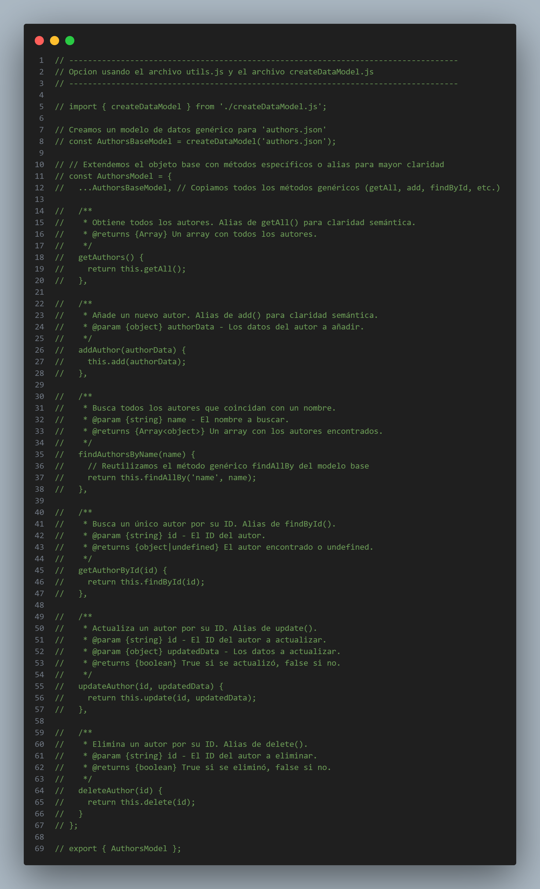

# Documentación Técnica - API de Gestión de Biblioteca

## 1. Introducción

Este documento proporciona un análisis técnico detallado de la arquitectura y el código de la API de Gestión de Biblioteca. El objetivo es explicar las decisiones de diseño, la estructura del proyecto y la funcionalidad de cada componente, siguiendo los requisitos del Trabajo Práctico Integrador.

## 2. Arquitectura General: Patrón Modelo-Vista-Controlador (MVC)

El proyecto está diseñado siguiendo estrictamente el patrón de diseño **MVC** para garantizar una clara separación de responsabilidades, lo que resulta en un código más limpio, mantenible y escalable.

*   **Modelo (`/src/models`)**: Es la capa de acceso a datos. Su única responsabilidad es interactuar directamente con la "base de datos" (los archivos `.json`). Contiene toda la lógica para leer, escribir, buscar, actualizar y eliminar registros. No tiene conocimiento de las peticiones del usuario ni de cómo se mostrarán los datos.

*   **Vista (`/src/views`)**: Es la capa de presentación. Su única responsabilidad es tomar los datos que le entrega el Controlador y darles un formato legible para la terminal. En este proyecto, la vista se materializa en el archivo `responseFormatter.js`, que construye las respuestas de éxito, error y las tablas de datos.

*   **Controlador (`/src/controllers`)**: Es la capa de lógica de negocio y el "cerebro" de la aplicación. Actúa como intermediario: recibe peticiones del Servidor, le pide los datos necesarios al Modelo, aplica las reglas de negocio (ej: verificar que un autor no tenga libros antes de eliminarlo) y finalmente le pasa los datos a la Vista para que prepare la respuesta final.

## 3. Análisis por Capas y Archivos

### 3.1. Capa de Modelos (`/src/models`)

Para la capa de modelos, se exploraron dos arquitecturas con diferentes niveles de abstracción y reutilización de código.

#### **Versión 1: Modelos Autónomos (Enfoque Directo)**

Esta es la implementación base, donde cada modelo (`authorsModel.js`, `booksModel.js`, `publishersModel.js`) es un archivo completamente independiente que contiene toda su propia lógica para interactuar con el sistema de archivos (`fs`).

*   **Ventajas:** Es un enfoque muy directo y fácil de entender. Cada archivo es autocontenido.
*   **Desventajas:** Conduce a una significativa **duplicación de código**. La lógica para leer, escribir, actualizar y eliminar es casi idéntica en los tres archivos, violando el **principio DRY (Don't Repeat Yourself)**.

 

---

#### **Versión 2: Arquitectura Ideal (Patrón Factory y Principio DRY)**

Para solucionar el problema de la duplicación de código, se propone una arquitectura más avanzada que abstrae la lógica común.

**`utils/utils.js` (Módulo de Utilidades)**

Este archivo es la base de la abstracción. Centraliza todas las operaciones de bajo nivel con el sistema de archivos.
*   **Responsabilidad Única:** Su única tarea es leer y escribir archivos JSON.
*   **Robustez:** Incluye un manejo de errores robusto, como el control del caso `ENOENT` (archivo no encontrado).


---

**`models/createDataModel.js` (Fábrica de Modelos)**

Este archivo implementa el **patrón de diseño Factory**. Es una función que construye un objeto Modelo completamente funcional para cualquier archivo JSON.
*   **Eliminación de Duplicación:** Toda la lógica CRUD está escrita una sola vez.
*   **Mantenibilidad:** Los cambios se hacen en un solo lugar y todos los modelos se benefician.


---

**Modelo Final (`authorsModel.js` usando la Fábrica)**

El resultado es que los modelos específicos se vuelven increíblemente simples y declarativos.



---

### 3.2. Capa de Vistas (`/src/views`)

La capa de Vistas se centraliza en `views/responseFormatter.js`, que se encarga de la presentación de los datos.

*   **Funcionalidad Clave:**
    *   **Formato Consistente:** `formatSuccess()` y `formatError()` usan emojis (`✅`, `❌`) para una retroalimentación visual clara.
    *   **Presentación Inteligente:** `formatSuccess()` detecta si los datos son un array (para mostrarlos como tabla) o un objeto (para mostrarlo como JSON).
    *   **Generación de Tablas Dinámicas:** La función `formatAsTable()` se adapta dinámicamente a cualquier tipo de dato, calculando el ancho de las columnas para una alineación perfecta.


> **Pie de foto:** Ejemplo de la salida generada por `formatAsTable()`. La Vista se adapta dinámicamente para mostrar todas las columnas de los libros.

---

### 3.3. Capa de Controladores (`/src/controllers`)

La capa de Controladores es el **"cerebro"** de la aplicación, donde reside toda la lógica de negocio.

*   **Rol y Responsabilidades:**
    *   **Orquestación:** Dirigen el flujo de una petición entre el Modelo y la Vista.
    *   **Lógica de Negocio:** Implementan las reglas clave como la prevención de duplicados, la "hidratación" de datos (reemplazar IDs por nombres) y la restricción de eliminación.
    *   **Validación de Datos:** Se aseguran de que los datos de entrada sean completos y correctos.


> **Pie de foto:** Implementación de la "restricción de eliminación". El controlador interactúa con `BooksModel` para asegurarse de que un autor no tenga libros asociados antes de proceder con su eliminación.


> **Pie de foto:** Ejemplo de lógica de negocio compleja. El método `addBook` valida duplicados y verifica que el autor y la editorial existan antes de guardar los datos.

---

## 4. Puntos de Entrada y Ejecución

### 4.1. El Servidor TCP (`server.js`)

Actúa como un **enrutador (router)** delgado y eficiente.
*   **Responsabilidades:**
    *   Crea el servidor TCP y maneja múltiples conexiones de clientes.
    *   Parsea los comandos entrantes para separar la acción de los datos.
    *   Delega toda la lógica de negocio a los controladores a través de un `switch` principal.


> **Pie de foto:** El `switch` actúa como el enrutador central, delegando cada comando al método del controlador apropiado.

---

### 4.2. La Interfaz de Usuario: El Cliente TCP (`client.js`)

Es la puerta de entrada para el usuario final.
*   **Características Clave:**
    *   **Menús Interactivos Guiados:** Utiliza un sistema de menús y sub-menús numéricos para una UX fluida y a prueba de errores.
    *   **Flujos de Múltiples Pasos (Máquina de Estados):** Utiliza una variable de estado (`nextAction`) para manejar operaciones complejas como "Editar" y "Eliminar", donde primero se busca un ítem y luego se actúa sobre él.
    *   **Conexión Persistente:** Mantiene una única conexión con el servidor para mayor eficiencia.


> **Pie de foto:** Ejemplo de la máquina de estados. Tras la búsqueda, el cliente recuerda que la acción pendiente es "editar" y procede a pedir el ID, creando un flujo de trabajo continuo.

--- 

## 5. Pruebas Automatizadas (`test.js`)

Para garantizar la calidad y el correcto funcionamiento de la API, se ha creado un script de pruebas automatizado.
*   **Propósito:** Ejecuta una secuencia predefinida de comandos que cubren el ciclo CRUD completo y las reglas de negocio, como la prevención de duplicados y la restricción de eliminación.
*   **Funcionalidad:** Sirve como una **prueba de regresión**, permitiendo verificar rápidamente que nuevos cambios no hayan roto la funcionalidad existente.

--- 

## 6. Diagrama de Flujo de una Petición (Ej: Eliminar un Autor)

A continuación se muestra un diagrama de flujo que ilustra la secuencia completa de eventos e interacciones entre las diferentes capas de la aplicación cuando un usuario intenta eliminar un autor.

```mermaid
sequenceDiagram
    participant Usuario
    participant Client
    participant Server
    participant AuthorsController
    participant BooksModel
    participant AuthorsModel
    participant ResponseFormatter

    Usuario->>+Client: 1. Elige 'Eliminar', categoría 'autor', busca "Borges"
    Client->>+Server: 2. Envía comando: "buscar autor Borges"
    Server->>+AuthorsController: 3. Enruta a getAuthorsByName("Borges")
    AuthorsController->>+AuthorsModel: 4. Llama a findAuthorsByName("Borges")
    AuthorsModel-->>-AuthorsController: 5. Devuelve [Array de autores]
    AuthorsController->>+ResponseFormatter: 6. Pasa el array para formatear
    ResponseFormatter-->>-AuthorsController: 7. Devuelve tabla de texto
    AuthorsController-->>-Server: 8. Devuelve respuesta formateada
    Server-->>-Client: 9. Envía respuesta al cliente
    Client-->>-Usuario: 10. Muestra la lista y pide el ID
    Usuario->>+Client: 11. Ingresa el ID del autor a eliminar
    Client->>+Server: 12. Envía comando: "eliminar autor <ID>"
    Server->>+AuthorsController: 13. Enruta a deleteAuthor(<ID>)
    AuthorsController->>+BooksModel: 14. Llama a findBooksByAuthorId(<ID>) para verificar dependencias
    BooksModel-->>-AuthorsController: 15. Devuelve [Array de libros] (vacío en este caso)
    Note right of AuthorsController: Lógica de Restricción:<br/>Si el array no estuviera vacío,<br/>se detendría aquí con un error.
    AuthorsController->>+AuthorsModel: 16. Llama a deleteAuthor(<ID>)
    AuthorsModel-->>-AuthorsController: 17. Devuelve 'true' (éxito)
    AuthorsController->>+ResponseFormatter: 18. Pasa el mensaje de éxito para formatear
    ResponseFormatter-->>-AuthorsController: 19. Devuelve mensaje de éxito formateado
    AuthorsController-->>-Server: 20. Devuelve respuesta final
    Server-->>-Client: 21. Envía respuesta final
    Client-->>-Usuario: 22. Muestra "Autor eliminado correctamente"
   ```