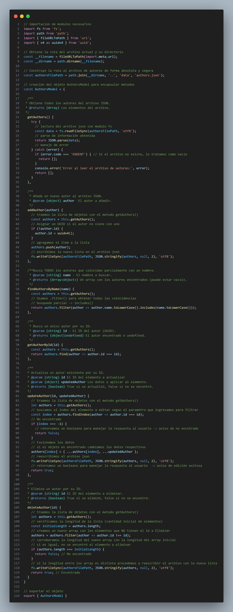
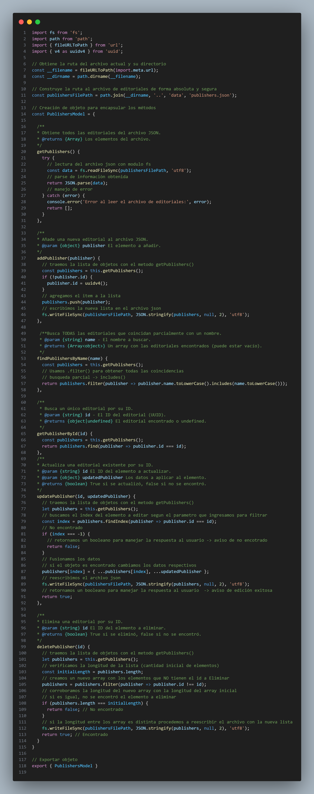
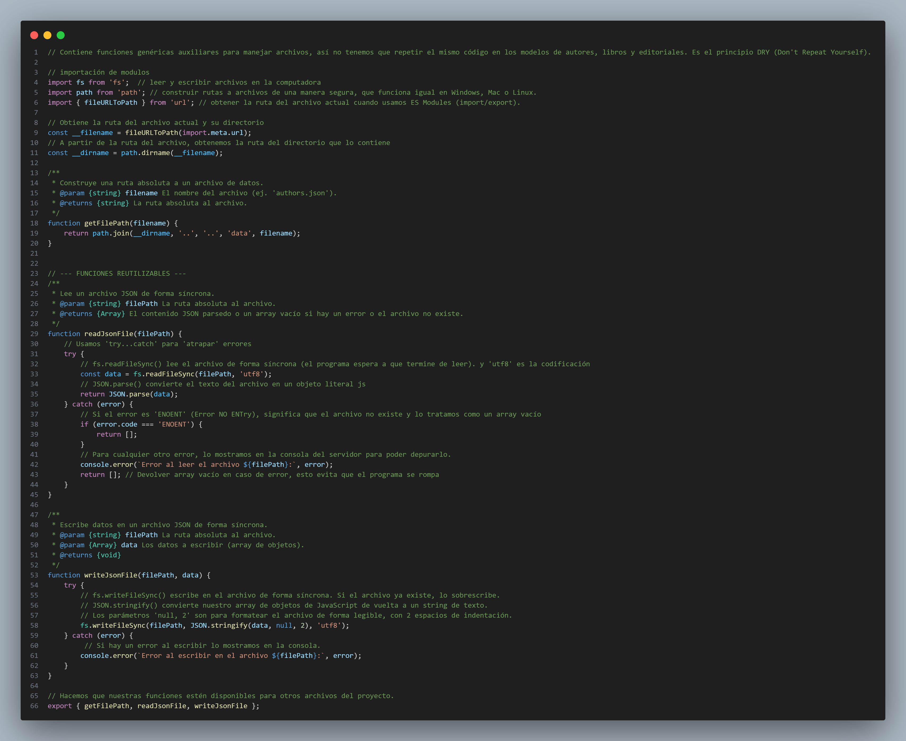
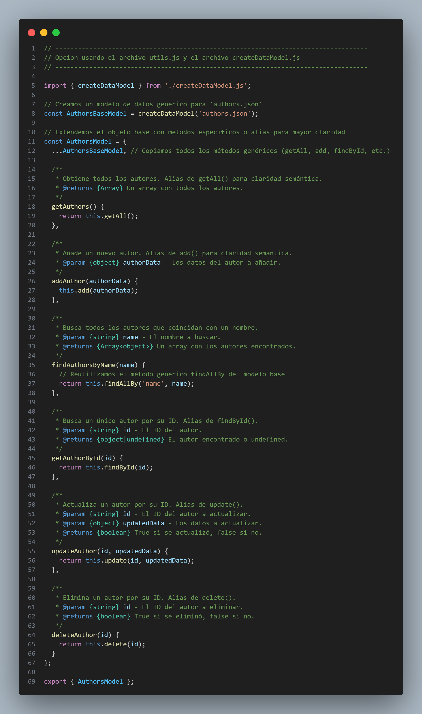
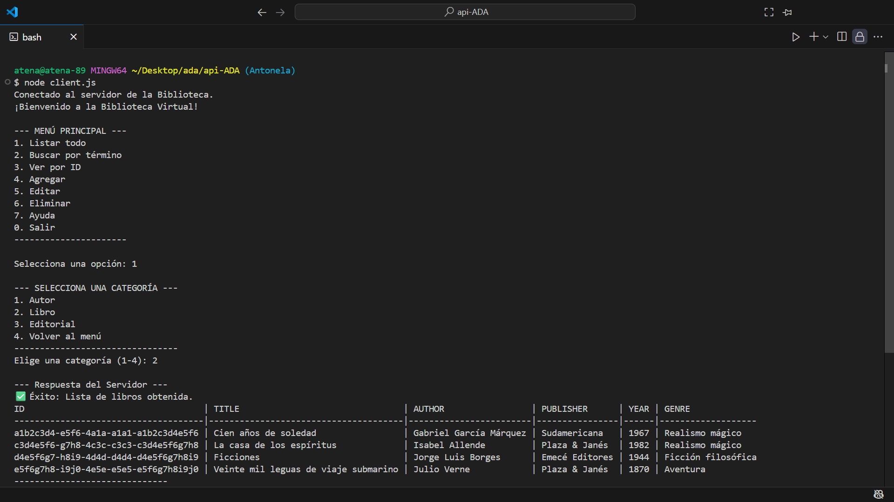
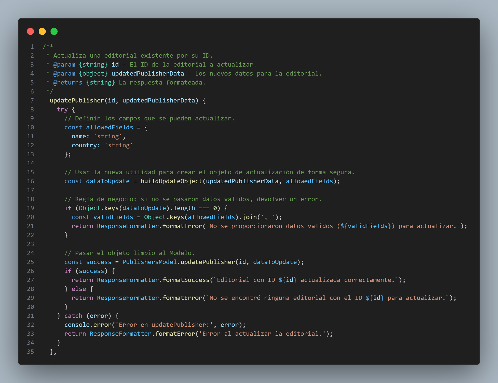
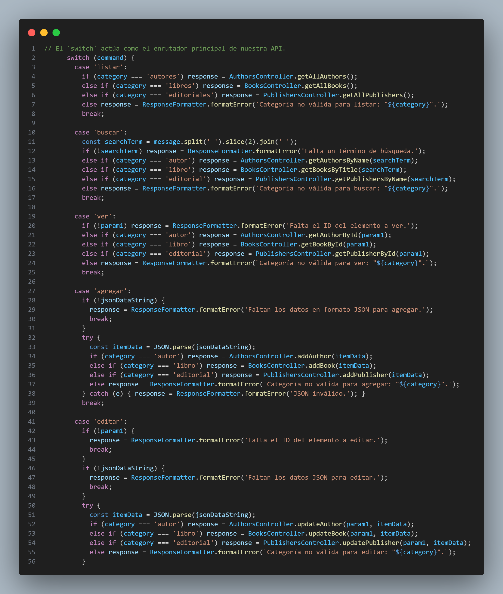

# Documentación Técnica - API de Gestión de Biblioteca

## 1. Introducción

Este documento proporciona un análisis técnico detallado de la arquitectura y el código de la API de Gestión de Biblioteca. El objetivo es explicar las decisiones de diseño, la estructura del proyecto y la funcionalidad de cada componente, siguiendo los requisitos del Trabajo Práctico Integrador.

## 2. Arquitectura General: Patrón Modelo-Vista-Controlador (MVC)

El proyecto está diseñado siguiendo estrictamente el patrón de diseño **MVC** para garantizar una clara separación de responsabilidades, lo que resulta en un código más limpio, mantenible y escalable.

- **Modelo (`/src/models`)**: Es la capa de acceso a datos. Su única responsabilidad es interactuar directamente con la "base de datos" (los archivos `.json`).
- **Vista (`/src/views`)**: Es la capa de presentación. Su única responsabilidad es tomar los datos que le entrega el Controlador y darles un formato legible para la terminal.
- **Controlador (`/src/controllers`)**: Es la capa de lógica de negocio y el "cerebro" de la aplicación. Actúa como intermediario entre el Servidor, el Modelo y la Vista.

## 3. Análisis por Capas y Archivos

### 3.1. Capa de Modelos (`/src/models`)

Para la capa de modelos, se exploraron dos arquitecturas con diferentes niveles de abstracción.

#### **Versión 1: Modelos Autónomos (Enfoque Directo)**

Esta es la implementación base, donde cada modelo es un archivo independiente.

- **Ventajas:** Es un enfoque muy directo y fácil de entender.
- **Desventajas:** Conduce a una significativa **duplicación de código**, violando el **principio DRY (Don't Repeat Yourself)**.

<div style="display: flex; justify-content: space-around;">
  <figure>
    
    <figcaption><code>authorsModel.js</code></figcaption>
  </figure>
  <figure>
    
    <figcaption><code>publishersModel.js</code></figcaption>
  </figure>
</div>

#### **Versión 2: Arquitectura Ideal (Patrón Factory y Principio DRY)**

Para solucionar la duplicación, se propone una arquitectura más avanzada.

**`/src/utils` (Carpeta de Utilidades)**

Para maximizar la reutilización de código, se creó una carpeta `/utils` que contiene módulos con responsabilidades bien definidas. Por ejemplo, `utils/utils.js`centraliza todas las operaciones de bajo nivel con el sistema de archivos para los modelos, siguiendo el Principio de Responsabilidad Única.

<figure align="center">
  
  <figcaption>Archivo <code>utils.js</code></figcaption>
</figure>

**`models/createDataModel.js` (Fábrica de Modelos)**

Implementa el **patrón de diseño Factory** para construir un objeto Modelo completamente funcional, eliminando el código repetido y mejorando la mantenibilidad.

<figure align="center">
  
  <figcaption>Archivo <code>createDataModel.js</code></figcaption>
</figure>

**Modelo Final (`authorsModel.js` usando la Fábrica)**

El resultado es que los modelos específicos se vuelven increíblemente simples y declarativos.

<figure align="center">
  
  <figcaption><code>AuthorsModel</code> usando la "fábrica" de modelos.</figcaption>
</figure>

---

### 3.2. Capa de Vistas (`/src/views`)

La capa de Vistas se centraliza en `views/responseFormatter.js`.

- **Funcionalidad Clave:** `formatSuccess()`, `formatError()` y `formatAsTable()` para una presentación de datos consistente, inteligente y dinámica. La función `formatAsTable()` se adapta a cualquier array de objetos, calculando anchos de columna para una alineación perfecta.

<figure align="center">
  
  <figcaption> Ejemplo de la salida generada por <code>formatAsTable()</code>.</figcaption>
</figure>

---

### 3.3. Capa de Controladores (`/src/controllers`)

La capa de Controladores es el **"cerebro"** de la aplicación, donde reside toda la lógica de negocio.

- **Lógica de Negocio Clave:**
  - **Prevención de Duplicados:** No permite agregar un ítem si ya existe uno con el mismo nombre/título.
  - **"Hidratación" de Datos:** Reemplaza los IDs de los libros por los nombres de autor y editorial.
  - **Restricción de Eliminación:** Impide eliminar un autor o editorial si tienen libros asociados, protegiendo la integridad de los datos.

<figure align="center">
  
  <figcaption> Implementación de la "restricción de eliminación" en <code>AuthorsController.js</code>.</figcaption>
</figure>

#### **Refactorización y Utilidades Clave (`/src/utils`)**

Para evitar la repetición de código y mejorar la mantenibilidad dentro de los controladores, la lógica común de manipulación de datos fue extraída a módulos de utilidades, siguiendo los principios **DRY** y de **Responsabilidad Única**

- **`utils/formatters.js`**: Centraliza funciones de formato de texto, como `toCapitalCase()`, garantizando una presentación de datos consistente.
- **`utils/objectUtils.js`**: Proporciona herramientas para trabajar con los objetos de datos que llegan desde el cliente. Las funciones clave son:

  - `getCaseInsensitiveValue()`: Permite obtener datos de un objeto sin preocuparse de si la clave está en mayúsculas o minúsculas (ej. `name` vs `NAME`).
  - `buildUpdateObject()`: Una función potente y segura que construye el objeto de datos para las actualizaciones. Filtra solo los campos permitidos, aplica el formato correcto a los strings y convierte los números a su tipo correcto, previniendo errores de integridad de datos.
    Esta refactorización hace que los métodos de los controladores, como `updateAuthor()`, sean mucho más limpios y se centren exclusivamente en la lógica de negocio.

<figure align="center">
  
  <figcaption> Ejemplo de validación múltiple y de <code>getCaseInsensitiveValue()</code> en <code>booksController.js</code>.</figcaption>
</figure>

<figure align="center">
  
  <figcaption> Empleo de <code>buildUpdateObject()</code> en <code>publishersController.js</code>.</figcaption>
</figure>

---

## 4. Puntos de Entrada y Ejecución

### 4.1. El Servidor TCP (`server.js`)

Actúa como un **enrutador (router)** delgado y eficiente, delegando toda la lógica a los controladores.

- **Responsabilidades:**
  - Crear el servidor TCP y manejar múltiples clientes.
  - Parsear los comandos entrantes.
  - Delegar la ejecución al controlador apropiado a través de un `switch` principal.

<figure align="center">
  
  <figcaption> El <code>switch</code> actúa como el enrutador central de la aplicación.</figcaption>
</figure>

### 4.2. La Interfaz de Usuario: El Cliente TCP (`client.js`)

Es la puerta de entrada para el usuario final, enfocado en una buena experiencia de usuario (UX).

- **Características Clave:**
  - **Menús Interactivos Guiados:** Utiliza menús numéricos para una interacción fluida y a prueba de errores.
  - **Flujos de Múltiples Pasos (Máquina de Estados):** Utiliza una variable de estado (`nextAction`) para manejar operaciones complejas como "Editar" y "Eliminar".
  - **Conexión Persistente:** Mantiene una única conexión con el servidor para mayor eficiencia.

<figure align="center">
  
  <figcaption> Ejemplo de la máquina de estados en acción durante el flujo de edición.</figcaption>
</figure>

---

## 5. Pruebas Automatizadas (`test.js`)

Para garantizar la calidad y el correcto funcionamiento de la API, se ha creado un script de pruebas automatizado.

- **Propósito:** Ejecuta una secuencia predefinida de comandos que cubren el ciclo CRUD completo y las reglas de negocio.
- **Funcionalidad:** Sirve como una **prueba de regresión**, permitiendo verificar rápidamente que nuevos cambios no hayan roto la funcionalidad existente.

---

## 6. Diagrama de Flujo de una Petición (Ej: Eliminar un Autor)

A continuación se muestra un diagrama de flujo que ilustra la secuencia completa de interacciones entre las capas de la aplicación.

````mermaid
sequenceDiagram
    participant Usuario
    participant Client
    participant Server
    participant AuthorsController
    participant BooksModel
    participant AuthorsModel
    participant ResponseFormatter

    Usuario->>+Client: 1. Elige 'Eliminar', 'autor', busca "Borges"
    Client->>+Server: 2. Envía comando: "SEARCH AUTHOR Borges"
    Server->>+AuthorsController: 3. Enruta a getAuthorsByName("Borges")
    AuthorsController->>+AuthorsModel: 4. Llama a findAuthorsByName("Borges")
    AuthorsModel-->>-AuthorsController: 5. Devuelve [Array de autores]
    AuthorsController->>+ResponseFormatter: 6. Pasa el array para formatear
    ResponseFormatter-->>-AuthorsController: 7. Devuelve tabla de texto
    AuthorsController-->>-Server: 8. Devuelve respuesta formateada
    Server-->>-Client: 9. Envía respuesta al cliente
    Client-->>-Usuario: 10. Muestra la lista y pide el ID
    Usuario->>+Client: 11. Ingresa el ID del autor a eliminar
    Client->>+Server: 12. Envía comando: "DELETE AUTHOR <ID>"
    Server->>+AuthorsController: 13. Enruta a deleteAuthor(<ID>)
    AuthorsController->>+BooksModel: 14. Llama a findBooksByAuthorId(<ID>)
    BooksModel-->>-AuthorsController: 15. Devuelve [Array de libros] (vacío)
    Note right of AuthorsController: Lógica de Restricción:<br/>Si el array no estuviera vacío,<br/>se detendría aquí con un error.
    AuthorsController->>+AuthorsModel: 16. Llama a deleteAuthor(<ID>)
    AuthorsModel-->>-AuthorsController: 17. Devuelve 'true' (éxito)
    AuthorsController->>+ResponseFormatter: 18. Pasa el mensaje de éxito
    ResponseFormatter-->>-AuthorsController: 19. Devuelve mensaje formateado
    AuthorsController-->>-Server: 20. Devuelve respuesta final
    Server-->>-Client: 21. Envía respuesta final
    Client-->>-Usuario: 22. Muestra "Autor eliminado"
    ```
````
